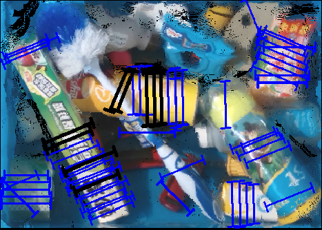
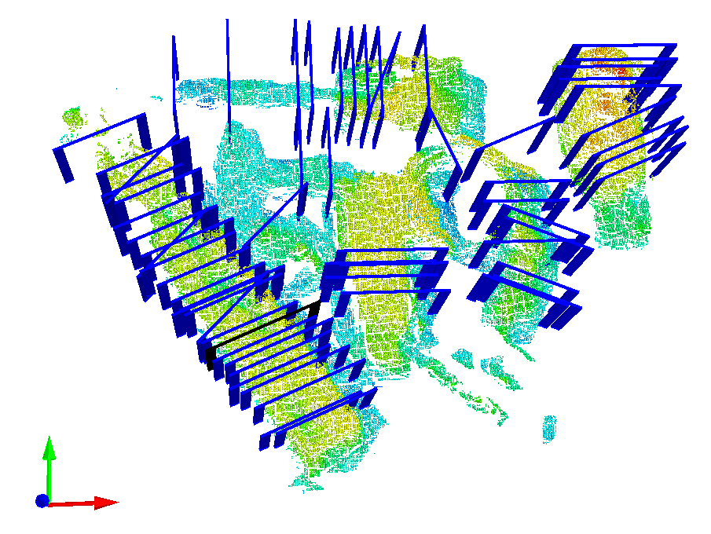

# toteGrasping
Dataset for robotic grasping in dense cluster

## Overview
This repository is the supplementary materials of the paper "GraspFusionNet: A two-stage grasp detection network for complete grasp parameters prediction based on fusion of RGB-XYZ heightmaps in dense cluster."[Video](https://www.youtube.com/watch?v=SsE5-FuK5jo) by Liu et al. In this repo, we provide  code of how to show grasp.

## Results
Known objects

	
	
	
	
	

	 
	
	
	
	

## Datasets
Download links for our grasping dataset  can be found on our [toteGrasping](http://vision.princeton.edu/projects/2017/arc/#datasets).

### Datasets Structure
* toteGrasping
	* toteGrasping/heightmap_color
		* toteGrasping/heightmap_color/0.6d.png: color heightmap.
  * toteGrasping/heightmap_depth
		* toteGrasping/heightmap_depth/0.6d_combine.npy: xyz heightmap, in meter.
  * toteGrasping/label_gPPN
		* toteGrasping/label_gPPN/0.6d_bad|good.npy: good (x,y,1,angle,width,depth),angle:deg,width:mm,depth:meter/10000..
  * toteGrasping/label_gRPN
		* toteGrasping/label_gRPN/0.6d.png: pixel wise label, graspable or non-graspable.
		* toteGrasping/label_gRPN/0.6d.npy: pixel wise label, angle,width,depth.
  * toteGrasping/label_show
		* toteGrasping/label_show/0.6d.png: original grasp label.
  * toteGrasping/train-split.txt: traing data
  * toteGrasping/test-split.txt:  test data

## Contact
If you have any questions, please let me know:  sjtu-wenhai[at]sjtu[dot]edu[dot]cn

